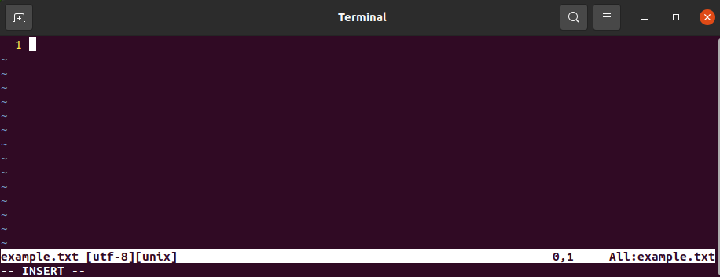
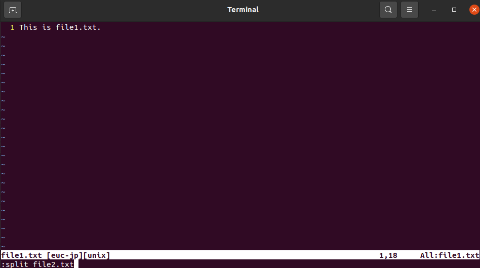
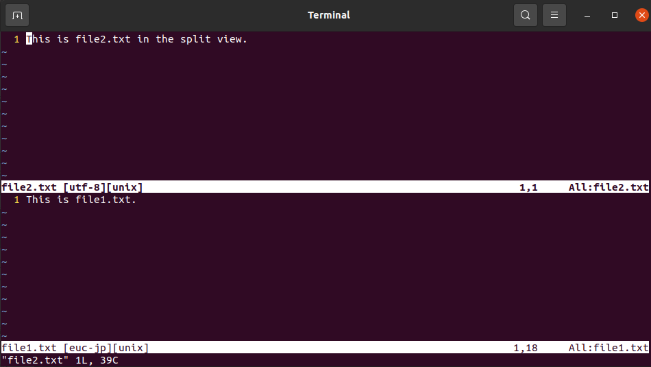
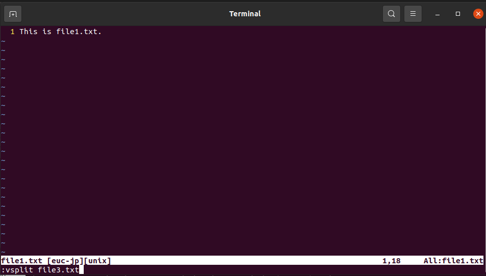
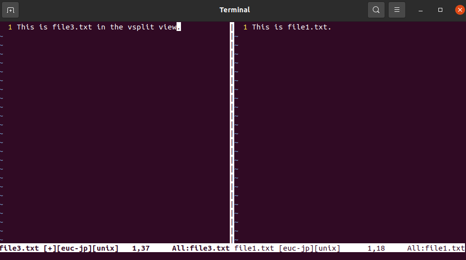
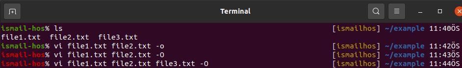

# `Vim` Text Editor

In Vim, there are three modes;

* `command` mode,
* `insert` mode,
* `visual` mode,

## `insert` mode

Press `i` for the `insert` mode to start writing something on the document. When you press `i`, you will see on the bottom-left corner that `--INSERT--` will be printed out. 

Type something and press `ESC` to go back the `command` mode.

### Entering `insert` mode

|Keys|Explanation|
|----|-----------|
|`i`       |To start typing where the cursor is|
|`shift+i` |To start typing at the beginning of the line where the cursor is|
|`a`       |To start typing one character right from where the cursor is|
|`shift+a` |To start typing at the end of the line where the cursor is|
|`o`       |To start typing one line below from where the cursor is|
|`shift+o` |To start typing one line above from where the cursor is|

## `command` mode

In the `command` mode, you can move on the text:

### Move the cursor on the text

|Keys|Explanation|
|----|-----------|
|`k` ↑      |To move the cursor up (or the upper arrow can be used)|
|`j` ↓      |To move the cursor down (or the lower arrow can be used)|
|`h` ←      |To move the cursor left (or left arrow can be used)|
|`l` →      |To move the cursor to the right (or the right arrow can be used)
|`w`        |To jump forwards to the start of a word (Punctuation is considered words as well)|
|`shift+w`  |To jump forwards to the start of a word (Punctuation is NOT considered words)|
|`e`        |To jump forwards to the end of a word (Punctuation is considered words as well.)|
|`shift+e`  |To jump forwards to the end of a word (Punctuation is NOT considered words)|
|`b`        |To jump backwards to the start of a word (Punctuation is considered words as well)|
|`shift+b`  |To jump backwards to the start of a word (Punctuation is NOT considered words)|
|`ge`       |To jump backwards to the end of a word (Punctuation is considered words)|
|`g+shift+e`|To jump backwards to the end of a word (Punctuation is NOT considered words)|
|`g+g`      |To go to the first character of the document|
|`shift+g`  |To go to the last character of the document|
|`0`        |To go to the first character of the line|

### Select and copy or cut

|Keys|Explanation|
|----|-----------|
|`shift+v`         |You can select the current line|
|`ctrl+v`          |You can select character by character|
|`y+y`             |The current line is copied (copy 1 line)|
|`y+3`             |4 lines are copied (number starts at 0)|
|`shift+v` then `y`|The line is selected and copied|
|`ctrl+v` then `x` |The line is selected and cut|
|`p`               |Items which are selected are pasted|

### Undo and Redo

|Keys|Explanation|
|----|-----------|
|`u`      |You can undo your changes|
|`ctrl+r` |You can redo your changes|

### Editing

|Keys|Explanation|
|----|-----------|
|`c+c`    |Delete whole line and then be opened the `insert` mode|
|`c+w`    |Delete to end of the word after cursor and then be opened the `insert` mode|
|`d+d`    |Delete whole line and move the bottom line up|
|`shift+s`|Delete the whole line and then be opened the `insert` mode|

### General

|Keys|Explanation|
|----|-----------|
|`:w`   |Saves the document but do not quit|
|`:wq`  |Saves and quit the document|
|`:q`   |Quits the document|
|`:w!`  |Forcing Vim to save but do not quit|
|`:wq!` |Forcing Vim to save and quit|
|`:q!`  |Forcing Vim to only quit|

## Working on multiple files

In the `command` mode, you can open multiple files:

* Using `:split filename` horizontally divided
* Using `:vsplit filename` vertically divided

In the `command` mode, it is possible to move between files by pressing `ctrl+w+w`
 
You can save files and exit with `:wq` in the `command` mode or you can use `:wqall` to save all and exit from all files.

Other way to open files in split mode is opening them together from terminal commandline.

Here `-o` option splits view horizontally and (capital) `-O` splits it vertically.

