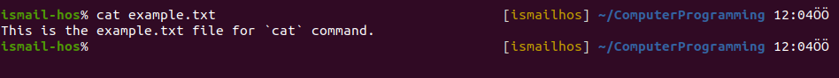
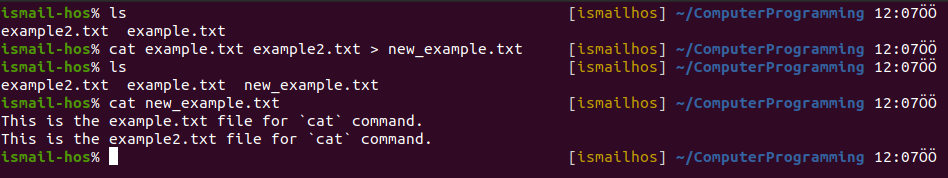

# Computer Programming
## `cat` Command 
This command can add content to a file, and this makes it super powerful.
In its simplest usage, `cat` prints a file's content to the standard output:

`cat example.txt` 

You can print the content of multiple files:

`cat example.txt example2.txt` 

and using the output redirection operator `>` you can concatenate the content of multiple files into a new file:

`cat example.txt example2.txt > new_example.txt`

Here, ***new_example.txt*** is a concatenated version of files ***example.txt*** and ***example2.txt***

