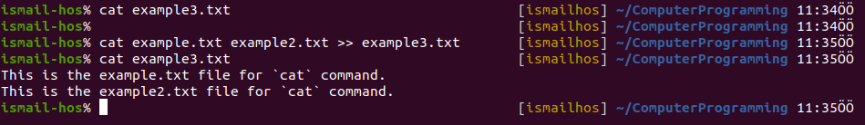
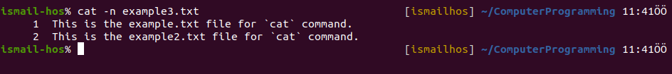
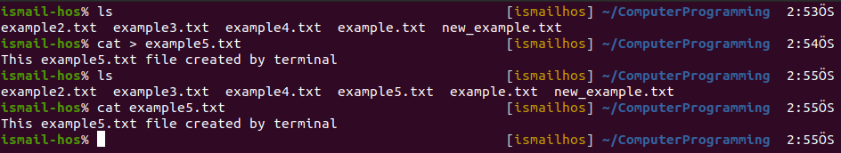
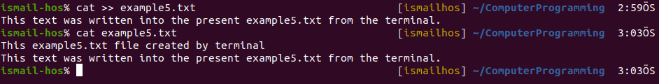
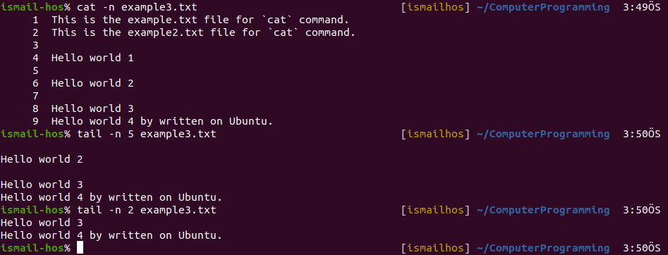
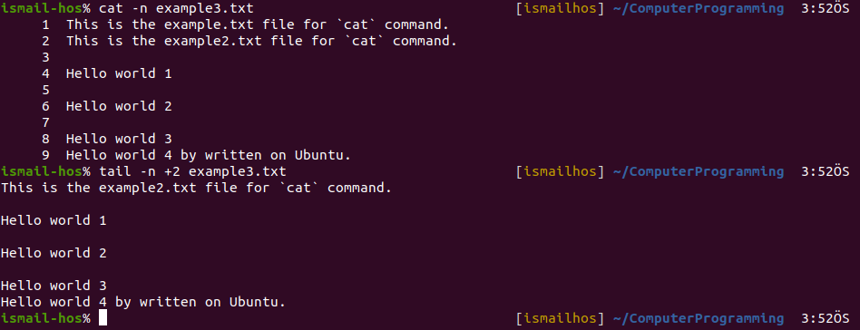

# Computer Programming
## `cat` Command 
This command can add content to a file, and this makes it super powerful.
In its simplest usage, `cat` prints a file's content to the standard output:

`cat example.txt` 

You can print the content of multiple files:

`cat example.txt example2.txt` 

and using the output redirection operator `>` you can concatenate the content of multiple files into a new file:

`cat example.txt example2.txt > new_example.txt`

Here, ***new_example.txt*** is a concatenated version of files ***example.txt*** and ***example2.txt***

Using `>>` you can append the content of multiple files into a new file, creating it if it does not exist:

`cat example.txt example2.txt >> example3.txt`

`cat example3.txt`

When you're looking at source code files it's helpful to see the line numbers. You can have cat print them using the -n option:

`cat -n example3.txt`

You can only add a number to non-blank lines using -b:

`cat -b example3.txt`

The command `cat > example5.txt` creates a new file as output. We can write text in this file from the terminal.

When we want to write in a present file via on terminal:

`cat >> example5.txt` 

## `tail` Command

You can print the last 2 (or NUM) lines in a file:

`tail -n 2 example3.txt`

You can print the whole file content starting from a specific line using + before the line number:

`tail -n +2 example3.txt`

## `mkdir` Command

You create folders using the mkdir command:

`mkdir fruits`

You can create multiple folders with one command:

`mkdir plants animals`

You can also create multiple nested folders by adding the -p option:

`mkdir -p fruits/apples`

You can also create a new set of nested files:

`mkdir -p vehicles/electric_vehicles/tesla_car`

## `rmdir` Command

Just as you can create a folder using `mkdir`, you can delete a folder using `rmdir`:

`mkdir test_file`

`rmdir test_file`

The folder you delete must be empty!

You can also delete multiple folders at once:

`mkdir testfile1 testfile2`

`rmdir testfile1 testfile2`

The folders you delete must be empty!

## `rm` Command
