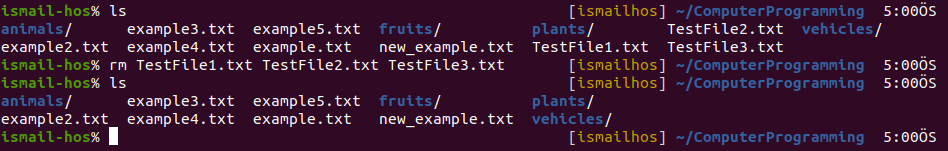
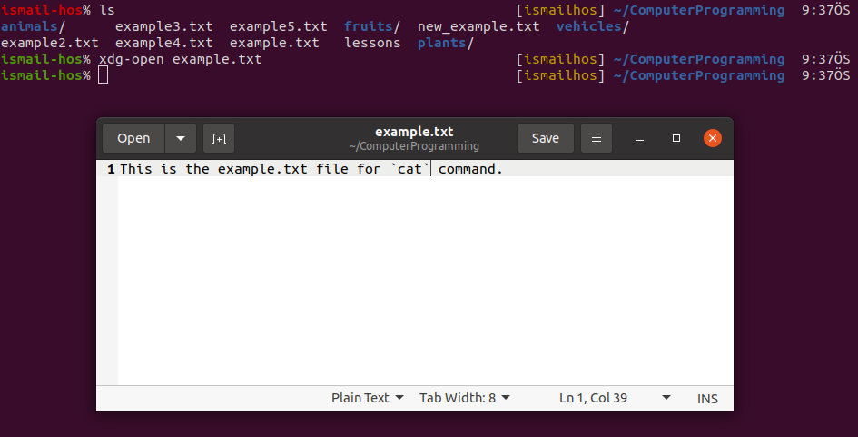
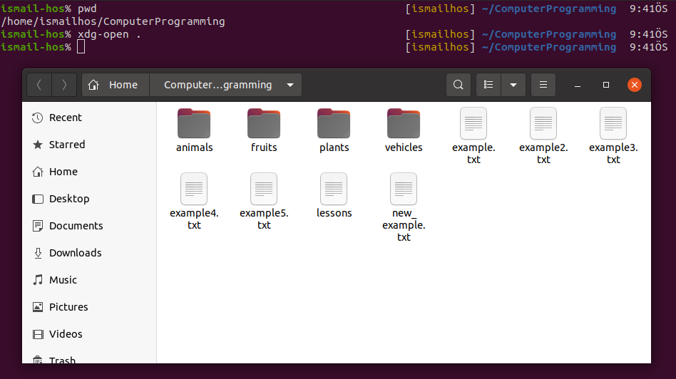
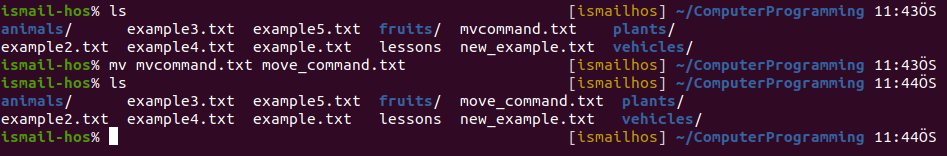
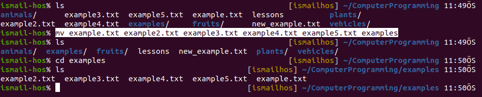

# Computer Programming

## `pwd` Command

`pwd` stands for `Print Work Directory` in Linux. Terminal opens at the home directory by default in Ubuntu. If you type pwd and press Enter you will see your home directory.

## `ls` Command

We can list the files and folders in a directory using this command. It shows the files and folders located in your /home/"computer_name" directory. 

`ls` also has some options with it. One of them is `ls -l` which prints the details of the files such as the size of a file in KB and the date that the file has been created.

The other is `ls -la` and used for printing also the hidden files starting with `.` in your working directory.

## `cd` Command

Once you have a folder, you can move into it using the `cd` command. `cd` means `Change Directory` in Linux. You invoke it specifying a folder to move into. You can specify a folder name, or an entire path.

You can use the `..` special path to indicate the parent folder:

`cd ..` 

## `cat` Command 

This command can add content to a file, and this makes it super powerful.
In its simplest usage, `cat` prints a file's content to the standard output:

`cat example.txt` 

You can print the content of multiple files:

`cat example.txt example2.txt` 

and using the output redirection operator `>` you can concatenate the content of multiple files into a new file:

`
cat example.txt example2.txt > new_example.txt
`

Here, ***new_example.txt*** is a concatenated version of files ***example.txt*** and ***example2.txt***

Using `>>` you can append the content of multiple files into a new file, creating it if it does not exist:

`
cat example.txt example2.txt >> example3.txt
`

`
cat example3.txt
`

When you're looking at source code files it's helpful to see the line numbers. You can have cat print them using the -n option:

`cat -n example3.txt`

You can only add a number to non-blank lines using -b:

`cat -b example3.txt`

The command `cat > example5.txt` creates a new file as output. We can write text in this file from the terminal.

When we want to write in a present file via on terminal:

`cat >> example5.txt` 

## `tail` Command

You can print the last 2 (or NUM) lines in a file:

`tail -n 2 example3.txt`

You can print the whole file content starting from a specific line using + before the line number:

`tail -n +2 example3.txt`

## `mkdir` Command

You create folders using the mkdir command:

`mkdir fruits`

You can create multiple folders with one command:

`mkdir plants animals`

You can also create multiple nested folders by adding the -p option:

`mkdir -p fruits/apples`

You can also create a new set of nested files:

`mkdir -p vehicles/electric_vehicles/tesla_car`

## `rmdir` Command

Just as you can create a folder using `mkdir`, you can delete a folder using `rmdir`:

`mkdir test_file`

`rmdir test_file`

The folder you delete must be empty!

You can also delete multiple folders at once:

`mkdir testfile1 testfile2`

`rmdir testfile1 testfile2`

The folders you delete must be empty!

## `rm` Command

To delete folders with files in them, we'll use the more generic `rm` command which deletes files and folders, using the `-rf` option:

When this command is used alone, it only deletes files, not folders.

`rm TestFile.txt`

If this command is used with `-rf` option, deletes everything such as folders and files. 

## `touch` Command

You can create an empty file or files using the touch command:

`touch lessons`

## `xdg-open` Command

`xdg-open file_name or folder_name` 

This command opens the specified file or folder.

To open current directory:

`xdg-open .` is always used to open the current directory. Here the dot represents the current directory.

## `mv` Command

Once you have a file, you can move it around using the `mv` command. You specify the file current path, and its new path:

`mv mvcommand.txt move_command.txt`

Here, mvcommand.txt is renamed as move_command.txt.

`mv move_command.txt plants`

Here, move_command.txt is moved into the plants folder.

If the last parameter is a folder, the file located at the first parameter path is going to be moved into that folder. In this case, you can specify a list of files and they will all be moved in the folder path identified by the last parameter:

`mv example.txt example2.txt example3.txt example4.txt example5.txt examples`

## `cp` Command

You can copy a file using the `cp` command:

To copy folders you need to add the `-r` option to recursively copy the whole folder contents:

To copy multiple files to in to a folder:

`cp lesson1 lesson1_new lessons_folder` --> The lesson1 and lesson1_new is copied in to the lessons_folder

